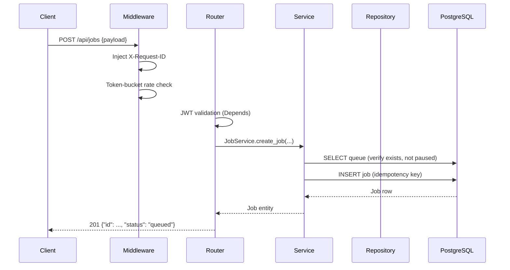
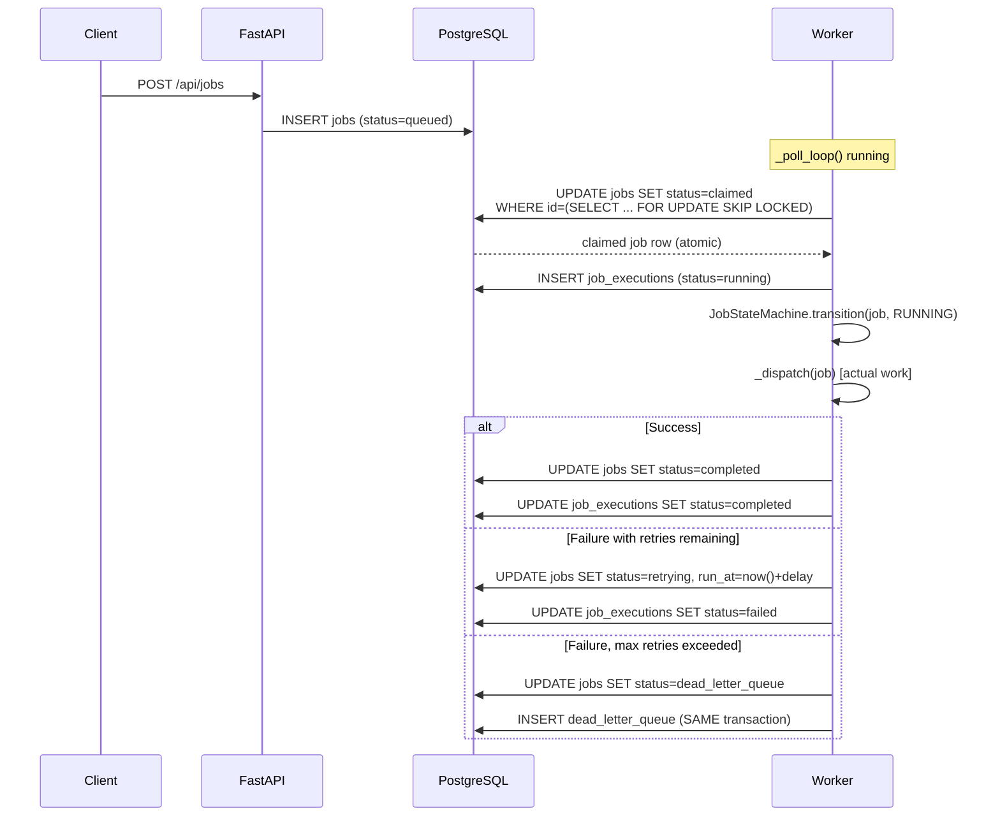
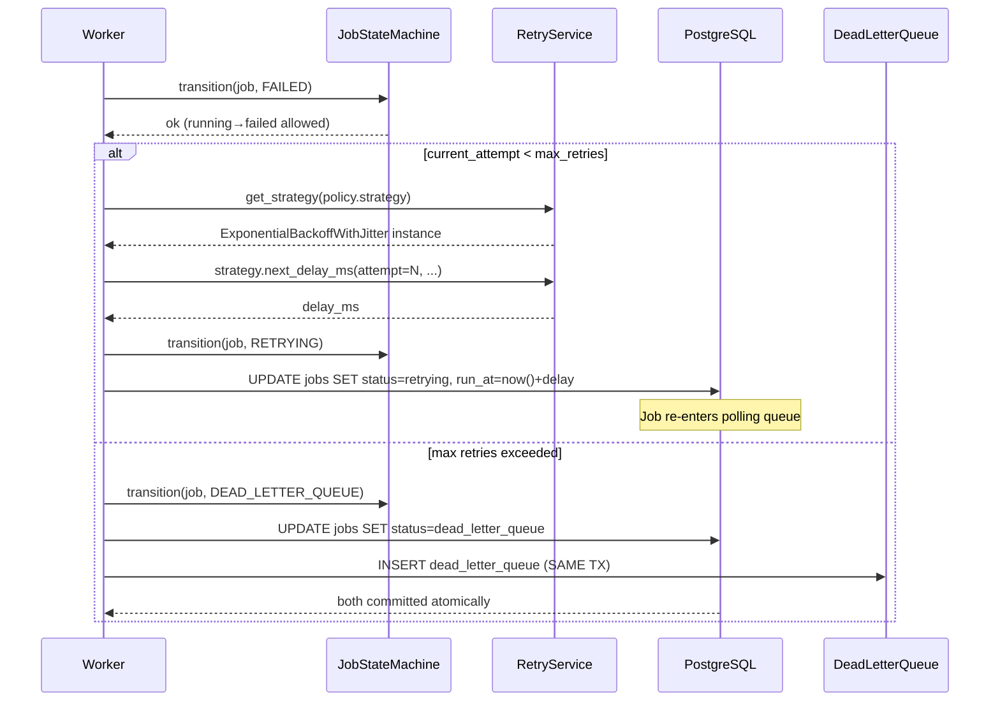

# Architecture — Distributed Job Scheduling Platform

## Overview

A production-grade, horizontally scalable job scheduling system built with:

| Layer          | Technology                                          |
|----------------|-----------------------------------------------------|
| API            | FastAPI (async) + Uvicorn, Python 3.12              |
| Database       | PostgreSQL 16 + SQLAlchemy 2.0 (asyncpg)           |
| Worker         | Independent asyncio process (not BackgroundTasks)  |
| Frontend       | React 18 + TypeScript + Vite, Vanilla CSS          |
| Auth           | JWT (HS256) with refresh tokens + bcrypt           |
| Container      | Docker Compose (api, worker, postgres, frontend)   |

---

## Clean Architecture (strictly layered)

Dependencies point **inward only**. No outer layer may import from an inner layer.

```
┌─────────────────────────────────────────────────────┐
│  API (FastAPI Routers)                               │  ← HTTP boundary
│  backend/api/*.py                                    │
├─────────────────────────────────────────────────────┤
│  Services                                            │  ← Business logic
│  backend/services/*.py                               │
├─────────────────────────────────────────────────────┤
│  Repositories                                        │  ← DB access
│  backend/repositories/*.py                           │
├─────────────────────────────────────────────────────┤
│  Models (ORM)        │  Domain (pure Python)        │  ← Persistence
│  backend/models/*.py │  backend/domain/entities.py  │
└─────────────────────────────────────────────────────┘
```

Cross-cutting packages (no layer dependency):
- `backend/state_machine/` — job lifecycle enforcer
- `backend/retry/` — Strategy pattern for retry delays
- `backend/middleware/` — request-id, rate limiting

---

## Request Lifecycle Diagram



---

## Job Lifecycle Sequence



---

## Failure → Retry → DLQ Sequence



---

## Concurrency & Locking

### Why `SELECT FOR UPDATE SKIP LOCKED`?

The canonical approach to distributed queue claiming without a message broker
is to use Postgres advisory locks or row-level locks. We chose `FOR UPDATE SKIP LOCKED`
because:

1. **No polling overhead**: SKIP LOCKED means a concurrent worker's SELECT returns
   immediately with the next unlocked row, rather than blocking until the first
   worker releases its lock. This keeps poll latency consistently low even under
   high contention.

2. **Atomic claim**: We use an `UPDATE...WHERE id=(SELECT...FOR UPDATE SKIP LOCKED) RETURNING *`
   pattern — **one SQL statement** that both acquires the lock and transitions the status.
   A naive two-step approach (SELECT then UPDATE) has a TOCTOU race where two workers
   could both SELECT the same row before either executes the UPDATE.

3. **No double-claiming proof**: The first worker to execute the UPDATE acquires an
   exclusive row-level lock inside the transaction. The second worker's subquery either
   sees the row already locked (and skips it via SKIP LOCKED) or sees `status='claimed'`
   (and it doesn't match `status IN ('queued','retrying')`) — either way it moves to the
   next eligible row.

```sql
-- The atomic claim statement (parameterised, no injection risk):
UPDATE jobs
SET status    = 'claimed',
    worker_id = $1,
    updated_at = now()
WHERE id = (
    SELECT id FROM jobs
    WHERE queue_id    = $2
      AND status      IN ('queued', 'retrying')
      AND run_at      <= now()
      AND archived_at IS NULL
    ORDER BY priority DESC, run_at ASC
    LIMIT 1
    FOR UPDATE SKIP LOCKED
)
RETURNING id
```

### Supporting Index

```sql
-- ix_jobs_poll_claim — exactly the columns used by the worker query
CREATE INDEX ix_jobs_poll_claim ON jobs (queue_id, status, run_at)
WHERE status = 'queued' OR status = 'retrying';
```

The partial index covers only the two claimable statuses, keeping it small and
fast even with millions of completed/failed rows in the table.

### Heartbeat & Dead-Worker Reaper

Each worker runs **three independent asyncio tasks** in parallel:

| Task               | Interval  | Purpose                                          |
|--------------------|-----------|--------------------------------------------------|
| `_poll_loop`       | 1s        | Find and claim jobs from non-paused queues       |
| `_heartbeat_loop`  | 5s        | Write `WorkerHeartbeat` row, update `workers.updated_at` |
| `_reaper_loop`     | 10s       | Detect stale workers, requeue their jobs         |

**Key invariant**: `_heartbeat_loop` runs independently of `_poll_loop`. A job
that takes 60s to execute cannot block the heartbeat, preventing false
dead-worker detection by the reaper.

**Self-exclusion**: The reaper always appends `WHERE worker_id != self.worker_id`
to the stale-worker query. This prevents a race condition where a worker with a
briefly-delayed heartbeat would requeue its own in-flight jobs.

---

## Design Decisions & Trade-offs

| Decision | Choice | Alternative Considered | Rationale |
|----------|--------|------------------------|-----------|
| Queue backend | PostgreSQL FOR UPDATE SKIP LOCKED | Redis Streams / RabbitMQ | Zero extra infra; same Postgres already storing job metadata; proven at Shopify/Citus scale |
| State machine | Explicit transition table | Status field + ad-hoc checks | Illegal transitions are impossible to miss in review; table is reviewable spec |
| Retry strategies | Strategy Pattern (ABC + registry) | if/else in service | New strategies added by implementing one class; zero changes to callers |
| DLQ move | Atomic (job UPDATE + DLQ INSERT in same TX) | Two separate transactions | No window where job is neither retryable nor in DLQ |
| Worker lifecycle | Independent asyncio tasks | Single loop with heartbeat inline | Stuck jobs cannot starve heartbeats |
| Auth | JWT (HS256) with access + refresh | Session-based | Stateless; scales to N API pods without shared session store |
| Error envelope | `{"error": {"code", "message", "details"}}` | Flat `{"error": "...", "message": "..."}` | Nested structure is unambiguous; clients parse `error.code` not strings |
| Rate limiting | In-process token bucket | Redis-backed | Zero latency overhead; migrates to Redis by swapping the dict — interface unchanged |

---

## Multi-Tenant Isolation

```
Organization
  └── Project (1:N)
        └── Queue (1:N per project)
              └── Job (N per queue)
```

- All API endpoints require JWT authentication.
- Org-scoped endpoints verify `OrganizationMember` before returning data.
- No cross-org data leakage is possible: all queries include `project_id` or
  `organization_id` filters derived from the authenticated user's membership.

---

## Database Indexes (Performance)

| Index Name              | Columns                         | Query It Serves                    |
|-------------------------|---------------------------------|------------------------------------|
| `ix_jobs_poll_claim`    | queue_id, status, run_at        | Worker polling (partial index)     |
| `ix_jobs_project_created` | project_id, created_at        | Dashboard job list                 |
| `ix_worker_heartbeats_detect` | worker_id, last_seen     | Dead-worker reaper                 |
| `uq_project_idempotency` | project_id, idempotency_key    | Idempotency enforcement            |
